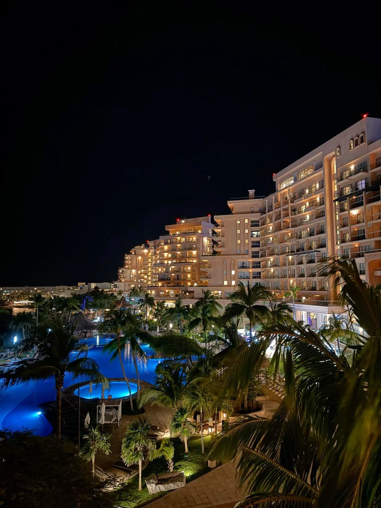
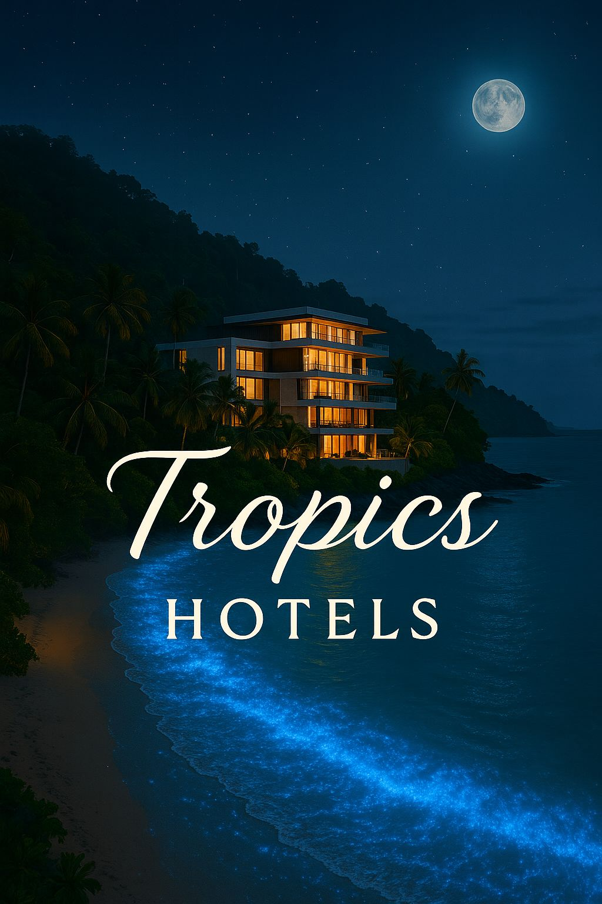

# 🌴 Tropics Hotel – Reservas & Experiencia Virtual

> **Demo visual** de una aplicación híbrida de reservas de hotel, desarrollada como parte del proyecto **Agente IA de Turismo y Hotelería**.  
> Incluye una interfaz web interactiva y una simulación del chat asistido por IA, integrando diseño, UX conversacional y gestión visual de reservas.

---

## 🏖️ Vista general

**Tropics Hotel** es una experiencia digital inmersiva que combina la estética moderna de un resort de lujo con la fluidez de un asistente virtual de reservas.  
La demo muestra cómo un visitante puede recorrer las habitaciones, consultar precios, y conversar con un **asistente personal inteligente** para confirmar su reserva.

  

---

## 💡 Características principales

- 🏠 **Página web responsiva** con galería dinámica de habitaciones.  
- 💬 **Asistente virtual** (botón verde “Asistente personal”) con flujo de conversación guiado.  
- 🧭 **Simulador de chat** que muestra en tiempo real la conexión entre cliente y agente.  
- 🎨 **Diseño UI/UX premium**: estética cálida, transiciones suaves y tipografía legible.  
- 🌐 **100% frontend** – Sin dependencias de servidor, perfecto para demo visual en GitHub Pages.  

---

## 🖼️ Capturas de la experiencia

### Página principal

  

### Simulación de chat

  

---

> Esta versión es una **demo estática** para portafolio.  
> El proyecto completo integra conexión con **Google Sheets**, **Telegram Bot** y un **panel analítico** para managers del hotel.

---

## 🧑‍💻 Autor

**Desarrollado por:** [Santino Sebastiani](#)  
💼 *Analista de datos & desarrollador de sistemas turísticos inteligentes.*

📬 Contacto: **santino.sebastiani@outlook.com**  
🌐 Portfolio: *en construcción*

---

## 🚀 Publicación

Este proyecto está desplegado mediante **GitHub Pages** y optimizado para visualización en desktop y mobile.  
Para explorarlo:

👉 **[Abrir la demo](#)**  
*(Una vez activado GitHub Pages, reemplaza este enlace por la URL oficial del repositorio.)*

---

## 🏗️ Tecnologías utilizadas

- **HTML5 / CSS3 / JavaScript**
- **Diseño responsivo con flex y grid**
- **UI minimalista con acentos tropicales**
- **Optimización de imágenes para carga rápida**

---

## ✨ Créditos visuales

- Imágenes libres de uso tomadas de *Unsplash / Pexels*.  
- Diseño y disposición adaptados para la marca **Tropics Hotel**.  

---

   
  <b>© 2025 Tropics Hotel – Experiencia visual creada con pasión y detalle.</b>

